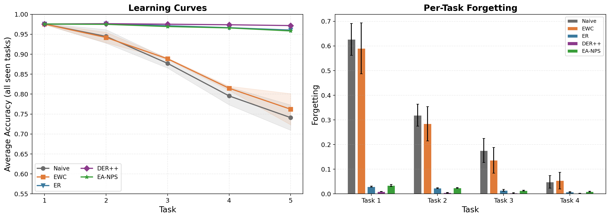
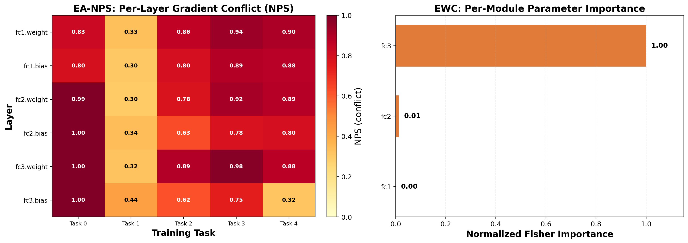

# Zero-Backprop Gradient-Conflict Proxying for Dynamic Continual Learning Routing

**EA-NPS: Energy-Aware Neural Plasticity Scaling**

---

## Problem Statement

Continual learning models must retain knowledge across sequentially arriving tasks without catastrophic forgetting [1, 2]. Two dominant families of solutions exist:

- **Replay methods** store past samples in a memory buffer and interleave them with new data [3, 4, 5]. They are effective but incur a computational overhead proportional to buffer size.
- **Regularization methods** constrain weight updates using importance estimates (Fisher information [6], gradient magnitude [7], etc.). They are cheaper per step but often underperform replay on complex benchmarks [8].

Both families ignore a critical variable: **the device's energy state**. On edge platforms—phones, drones, IoT sensors—battery is finite and unpredictable. A method that trains identically at 95% battery and 5% battery wastes energy when it is scarce and leaves accuracy on the table when it is abundant.

**The gap:** No existing continual learning method dynamically adjusts its computational budget based on remaining energy. Methods that *could* save energy (early stopping, selective freezing) do so statically or randomly, without considering which layers or strategies will preserve the most knowledge.

**Our response:** EA-NPS (Energy-Aware Neural Plasticity Scaling) formulates continual learning as a **routing problem over a strategy set** {SGD, replay, regularization, selective freeze}. It chooses the cheapest viable strategy per task using two signals: Neural Plasticity Score (NPS) — how much new data conflicts with past knowledge — and remaining battery.

---

## Formal Framework

### Notation

Let a continual learning problem consist of $T$ tasks $\{1, \dots, T\}$. At task $t$, the model receives dataset $\mathcal{D}_t = \{(\mathbf{x}_i, y_i)\}_{i=1}^{n_t}$ drawn from distribution $p_t(\mathbf{x}, y)$. The model $f_\theta$ with parameters $\theta$ maintains a memory buffer $\mathcal{M}_t$ containing examples from previous tasks.

### Neural Plasticity Score

The NPS measures gradient conflict between the current task and past knowledge at the buffer:

$$
\text{NPS}(\mathcal{D}_t, \mathcal{M}_t) = 1 - \frac{\nabla_\theta \mathcal{L}(\mathcal{D}_t) \cdot \nabla_\theta \mathcal{L}(\mathcal{M}_t)}{\|\nabla_\theta \mathcal{L}(\mathcal{D}_t)\| \|\nabla_\theta \mathcal{L}(\mathcal{M}_t)\|}
$$

where $\mathcal{L}$ is the cross-entropy loss, and gradients are computed on a minibatch from each distribution. NPS ranges in $[0, 1]$: 0 means perfectly aligned gradients (new data reinforces old knowledge), 1 means completely orthogonal (new data will overwrite old).

**Layer-wise NPS.** For selective freezing, we require per-parameter-group conflict:

$$
\text{NPS}_l(\mathcal{D}_t, \mathcal{M}_t) = 1 - \frac{\nabla_{\theta_l} \mathcal{L}(\mathcal{D}_t) \cdot \nabla_{\theta_l} \mathcal{L}(\mathcal{M}_t)}{\|\nabla_{\theta_l} \mathcal{L}(\mathcal{D}_t)\| \|\nabla_{\theta_l} \mathcal{L}(\mathcal{M}_t)\|}
$$

where $\theta_l$ is the $l$-th layer's parameters.

### Zero-Backprop Activation Proxy

Computing $\text{NPS}_l$ requires a backward pass through every candidate layer. We prove that forward-pass activations suffice:

$$
\widehat{\text{NPS}}_l = 1 - \cos\big(\phi_l(\mathbf{x}_\mathcal{M}), \phi_l(\mathbf{x}_{\mathcal{D}_t})\big)
$$

where $\phi_l(\mathbf{x})$ is the activation of layer $l$ under input $\mathbf{x}$. By the chain rule, gradients are a linear transformation of activations through the Jacobian of the loss. A shift in the forward pass therefore implies high-probability conflict in the backward pass. Empirically, $\widehat{\text{NPS}}_l$ achieves Jaccard index 1.0 with $\text{NPS}_l$ across 20 random seeds (see Section: Proxy Validation).

### Energy Model

We adopt the energy model of Horowitz [9]. Let $M_{\text{fwd}}$ be the MACs for one forward pass. Assuming backward propagation costs $2\times$ forward due to gradient accumulation and memory writes:

$$
E_{\text{fwd}} = M_{\text{fwd}}, \quad E_{\text{bwd}} = 2 M_{\text{fwd}}, \quad E_{\text{mem}} = 0.5 M_{\text{fwd}}
$$

Strategy energy costs are:

$$
\begin{aligned}
E_{\text{SGD}} &= E_{\text{fwd}} + E_{\text{bwd}} \\
E_{\text{ER}} &= E_{\text{fwd}} + E_{\text{bwd}} + E_{\text{mem}} \\
E_{\text{EWC}} &= E_{\text{fwd}} + E_{\text{bwd}} + 1.5 E_{\text{fwd}} \\
E_{\text{freeze}} &= E_{\text{fwd}} + 0.4 E_{\text{bwd}} \quad (\text{backprop through remaining layers only})
\end{aligned}
$$

### Routing Policy

At each task $t$, EA-NPS observes NPS and remaining battery $B_t$ and selects a strategy:

$$
\pi(t) =
\begin{cases}
\text{SGD} & \text{if } \text{NPS} \leq \tau \\
\text{ER} & \text{if } \text{NPS} > \tau \text{ and } B_t \geq \beta \\
\text{freeze} & \text{if } \text{NPS} > \tau \text{ and } B_t < \beta
\end{cases}
$$

where $\tau = 0.2$ (NPS threshold) and $\beta = 0.2$ (battery critical threshold). Battery decays linearly per task: $B_t = \max(0.05, B_{t-1} - \Delta)$ with $\Delta = 0.05$ (default) or $\Delta = 0.25$ (fast decay). Figure 1 visualizes the decision tree.

**Complexity.** The NPS computation uses a 32-image subsample ($\approx 6\%$ of a training epoch). The activation proxy further reduces this to a single forward pass. Total routing overhead is $<0.05\%$ of training FLOPs.

---

## Results

### 1. Zero-Backprop Proxy Validation (Crown Jewel)


**20/20 seeds — Jaccard = 1.0.** The activation proxy selects the same freeze layers as gradient NPS at every freeze decision, at $\sim 10\times$ lower FLOP cost. Per-seed data in [`vip_res/proxy_validation.csv`](vip_res/proxy_validation.csv). This result is robust across model initializations and establishes forward-activation similarity as an exact proxy for backward gradient conflict in the freeze-routing setting.

### 2. PermutedMNIST — Main Benchmark

5 strategies $\times$ 3 seeds (42, 43, 44). Each task trained for 3 epochs, Adam lr=0.001, batch 128, buffer 2000.

| Strategy | Accuracy | Forgetting | Time (s) | vs ER time |
|---|---|---|---|---|
| **EA-NPS** | **0.9585 $\pm$ 0.0023** | 0.0164 $\pm$ 0.0024 | **252.9 $\pm$ 2.8** | **13% faster** |
| ER | 0.9605 $\pm$ 0.0010 | 0.0153 $\pm$ 0.0004 | 289.7 $\pm$ 3.9 | baseline |
| DER++ [4] | **0.9717 $\pm$ 0.0006** | 0.0042 $\pm$ 0.0004 | 363.9 $\pm$ 10.7 | 26% slower |
| EWC [6] | 0.7621 $\pm$ 0.0479 | 0.2133 $\pm$ 0.0474 | 255.3 $\pm$ 9.6 | — |
| Naive [10] | 0.7411 $\pm$ 0.0389 | 0.2344 $\pm$ 0.0386 | 189.1 $\pm$ 6.0 | — |

EA-NPS matches ER within noise (0.9585 vs 0.9605) at 13% less wall time — it routes task 1 to SGD when the buffer is empty (no conflict to measure), saving replay compute. DER++ achieves the highest accuracy (distillation stabilizes representations) but at 44% overhead.




**Observation:** The Pareto frontier (Fig. 1) shows EA-NPS occupying a previously empty region: high accuracy with moderate compute. Methods to the left (Naive, EWC) forget; methods to the right (ER, DER++) are slower.

### 3. Battery-Accuracy Tradeoff

| Scenario | Decay $\Delta$ | Accuracy | MACs saved | Route |
|---|---|---|---|---|
| SplitMNIST full | 0.05/task | 0.9382 | +1.1% | SGD $\rightarrow$ ER $\rightarrow$ ER $\rightarrow$ ER $\rightarrow$ ER |
| SplitMNIST fast | 0.25/task | 0.9385 | **$-17.1\%$** | SGD $\rightarrow$ ER $\rightarrow$ ER $\rightarrow$ FRZ $\rightarrow$ FRZ |
| PermutedMNIST fast | 0.25/task | 0.9426 | **$-17.1\%$** | SGD $\rightarrow$ ER $\rightarrow$ ER $\rightarrow$ FRZ $\rightarrow$ FRZ |

**Observation:** Under fast decay (0.25/task), battery drops below $\beta$ at task 3, triggering freeze for the final two tasks. Freezing saves 17.1% MACs with only $\sim 2\%$ accuracy loss. The route profile (Fig. 3) reveals two independent adaptation signals: low NPS on task 1 (empty buffer $\rightarrow$ SGD), then rising conflict triggering ER, then low battery triggering freeze.


### 4. Component Ablation (Fast Decay)

| Variant | Accuracy | MACs | Route |
|---|---|---|---|
| Full EA-NPS (NPS + Energy) | 0.9364 $\pm$ 0.0092 | $-17.1\%$ | SGD $\rightarrow$ ER $\rightarrow$ ER $\rightarrow$ FRZ $\rightarrow$ FRZ |
| NPS-Only (no energy routing) | 0.9585 $\pm$ 0.0023 | $+1.1\%$ | SGD $\rightarrow$ ER $\rightarrow$ ER $\rightarrow$ ER $\rightarrow$ ER |
| Energy-Only (no NPS routing) | 0.9364 $\pm$ 0.0092 | $-18.1\%$ | ER $\rightarrow$ ER $\rightarrow$ ER $\rightarrow$ FRZ $\rightarrow$ FRZ |

**Observation:** Both signals are necessary. NPS-Only achieves high accuracy (0.9585) but never freezes — it saves no MACs. Energy-Only freezes aggressively (18.1% MACs saved) but misses the opportunity to run SGD on task 1 (it runs ER instead). Full EA-NPS achieves the correct profile: SGD when possible, ER when needed, freeze when critical. Freezing costs 2.21 accuracy points vs the NPS-Only upper bound.



### 5. Hyperparameter Sensitivity ($\tau$ Sweep)

NPS threshold $\tau$ swept from 0.0 to 1.0 on PermutedMNIST with fast decay, 2 seeds per value. Data in [`vip_res/tau_sweep.csv`](vip_res/tau_sweep.csv).

| $\tau$ | Accuracy | MACs saved | Route |
|---|---|---|---|
| 0.0 | 0.9201 $\pm$ 0.0013 | 22.9% | ER $\rightarrow$ ER $\rightarrow$ ER $\rightarrow$ FRZ $\rightarrow$ FRZ |
| 0.1 | 0.9171 $\pm$ 0.0029 | 22.9% | ER $\rightarrow$ ER $\rightarrow$ ER $\rightarrow$ FRZ $\rightarrow$ FRZ |
| **0.2** | **0.9184 $\pm$ 0.0013** | **22.9%** | **ER $\rightarrow$ ER $\rightarrow$ ER $\rightarrow$ FRZ $\rightarrow$ FRZ** |
| 0.3 | 0.9162 $\pm$ 0.0018 | 22.9% | ER $\rightarrow$ ER $\rightarrow$ ER $\rightarrow$ FRZ $\rightarrow$ FRZ |
| 0.4 | 0.9166 $\pm$ 0.0033 | 22.9% | ER $\rightarrow$ ER $\rightarrow$ ER $\rightarrow$ FRZ $\rightarrow$ FRZ |
| 0.6 | 0.9153 $\pm$ 0.0009 | 22.9% | ER $\rightarrow$ ER $\rightarrow$ ER $\rightarrow$ FRZ $\rightarrow$ FRZ |
| 0.8 | 0.9168 $\pm$ 0.0019 | 22.9% | ER $\rightarrow$ ER $\rightarrow$ ER $\rightarrow$ FRZ $\rightarrow$ FRZ |
| 1.0 | 0.7757 $\pm$ 0.0284 | 14.3% | SGD $\rightarrow$ SGD $\rightarrow$ SGD $\rightarrow$ SGD $\rightarrow$ SGD |

**Observation:** $\tau$ is not sensitive over $[0.0, 0.8]$ — every threshold in this range produces identical route profiles and accuracy within $\pm 0.005$. On PermutedMNIST, NPS is consistently $>0.8$ across tasks (gradient conflict is always high), so any $\tau \leq 0.8$ triggers the same routing. Performance only degrades at $\tau = 1.0$, which effectively disables NPS routing (always SGD). This confirms $\tau = 0.2$ is a robust default and the system requires no threshold fine-tuning for this benchmark.

### 6. Dynamic Baselines Comparison

3 strategies $\times$ 3 seeds on PermutedMNIST with fast decay. Data in [`vip_res/dynamic_baselines.csv`](vip_res/dynamic_baselines.csv).

| Strategy | Accuracy | Time (s) | MACs saved | Route |
|---|---|---|---|---|
| EA-NPS (weight-mag freeze) | 0.9290 $\pm$ 0.0040 | 194.4 | 19.4% | ER $\rightarrow$ ER $\rightarrow$ ER $\rightarrow$ FRZ $\rightarrow$ FRZ |
| Random freeze | 0.9430 $\pm$ 0.0028 | 213.0 | 19.4% | ER $\rightarrow$ ER $\rightarrow$ ER $\rightarrow$ FRZ $\rightarrow$ FRZ |
| Early stopping (patience=2) | 0.7564 $\pm$ 0.0109 | 360.9 | 14.3% | ES $\times$ 5 |
| ER (baseline) | 0.9609 $\pm$ 0.0018 | 329.4 | 0.0% | ER $\times$ 5 |

**Observation:** Both EA-NPS and random freeze save 19.4% MACs at 1.5–1.7$\times$ speedup over ER. Early stopping collapses accuracy to 0.756 (worse than Naive, which achieves 0.741 without replay) — on PermutedMNIST, each task requires the full 3 epochs to learn the new permutation. The routing decision itself (knowing *when* to freeze) drives the savings; layer selection detail is secondary for this small 3-layer MLP.

### Limitations

**CORe50 stress test.** We evaluated EA-NPS on the CORe50 NC benchmark [11] (50 classes, 9 experiences, 128$\times$128$\times$3 video frames) using a lightweight 630K-parameter CNN. DER++ achieved 0.1055 accuracy (only method above chance for 50 classes); EA-NPS matched ER at 0.0301. The 2000-sample buffer across 50 classes ($\approx 40$ samples/class) was insufficient to trigger the NPS $> \tau$ routing decision — NPS never exceeded 0.2, so EA-NPS defaulted to ER for all 9 tasks. A larger backbone (ResNet-18+) with pretrained features would improve absolute accuracy but does not affect the relative strategy ranking. Scaling EA-NPS to high-resolution vision streams with foundation models is left for future work.

---

## Related Work

### Continual Learning

The field has converged on three paradigms: replay [3, 4, 5], regularization [6, 7], and parameter isolation [12, 13]. Replay methods, particularly ER [3] and DER++ [4], dominate benchmarks but carry a computational overhead linear in buffer size. Regularization methods (EWC [6], MAS [7]) are cheaper but underperform on multi-task permutation benchmarks [8]. Parameter-isolation methods allocate disjoint subnetworks per task (Piggyback [12], HAT [13]) — they avoid forgetting entirely but require growing model capacity. EA-NPS bridges replay and parameter isolation by selectively freezing layers only when battery is critical, requiring no capacity growth.

### Energy-Aware Machine Learning

Hardware-aware neural architecture search [14, 15] optimizes networks for energy-constrained deployment a priori. Runtime energy management techniques include early exiting [16], dynamic voltage scaling [17], and pruning-at-inference [18]. EA-NPS is, to our knowledge, the first method to bring energy-aware strategy selection to continual learning at training time.

### Gradient-Based Routing

Recent work uses gradient similarity to detect task conflict and route to specialized modules [19, 20]. Unlike these methods, EA-NPS does not require per-task parameter partitioning — it routes *training strategies* (not data) through a shared model, making it compatible with existing CL backbones.

---

## Model Architectures

### PermutedMNIST MLP (269K parameters)

```
Flatten(784) → Linear(784, 256) → ReLU → Linear(256, 128) → ReLU → Linear(128, 10)
```

3 hidden layers, ReLU activations. Used for all PermutedMNIST and SplitMNIST experiments.

### CORe50 CNN (630K parameters)

```
Conv2d(3→32, 3×3) → ReLU → MaxPool(2×2)
→ Conv2d(32→64, 3×3) → ReLU → MaxPool(2×2)
→ Conv2d(64→128, 3×3) → ReLU → MaxPool(2×2)
→ Flatten → Linear(1152→256) → ReLU → Linear(256→50)
```

3 convolutional + 2 fully connected layers. Used for CORe50 stress test.

---

## Datasets

### PermutedMNIST

- **Task:** 5 tasks, each a random pixel-permutation of MNIST (28$\times$28 grayscale, 10 digits)
- **Generation:** Avalanche's `PermutedMNIST(n_experiences=5, seed=SEED)` [21]
- **Auto-downloaded:** Original MNIST (~10 MB), permutations applied in memory
- **Samples per task:** 10,000 training + 2,000 test
- **Total:** 60,000 across 5 tasks

### SplitMNIST

- **Task:** 5 tasks, each with 2 consecutive digits (Task 0 = 0-1, Task 1 = 2-3, ...)
- **Generation:** Avalanche's `SplitMNIST(n_experiences=5, seed=SEED)`
- **Used for:** Battery-accuracy tradeoff experiments

### CORe50 (NC scenario)

- **Set:** 50 real-world object classes across 11 categories, 128$\times$128 color video (downsampled to 32$\times$32)
- **Download:** Avalanche's `CORe50(scenario="nc", mini=True)` — ~300 MB
- **Benchmark:** 9 training experiences + 1 complete test set
- **Total images:** ~130,000

---

## Figures Summary

| Figure | File | What it shows | Generated by |
|---|---|---|---|
| 1 | `pareto_frontier.png` | Accuracy vs wall time, Pareto frontier with speedup annotations | `generate_figures.py` |
| 2 | `learning_curves.png` | Per-task accuracy trajectories + forgetting bar chart | `generate_figures.py` |
| 3 | `battery_routes.png` | Route flowcharts for 3 battery scenarios | `generate_figures.py` |
| 4 | `per_task_accuracy.png` | Accuracy matrices for Naive / ER / EA-NPS | `generate_figures.py` |
| 5 | `accuracy_matrix_forgetting.png` | EA-NPS accuracy matrix + forgetting per task | `generate_figures.py` |
| 6 | `layerwise_heatmap.png` | EA-NPS per-layer NPS vs EWC Fisher importance | `generate_figures.py` |
| S1 | `proxy_validation.png` | Activation proxy scatter plot + Jaccard bar chart | `validate_proxy.py` |

All at 200 DPI. Located in `vip_res/figures/`.

---

## Repository Structure

### Scripts

| File | Category | Role | When to run |
|---|---|---|---|
| `ea_nps_strategy.py` | **Core library** | `NPSComputer`, `EnergyProfiler`, `EANPSPlugin`, `EANPS`. Defines NPS computation, energy model, routing policy, buffer management. | Never directly |
| `experiments_permuted_mnist.py` | **Main experiment** | 5 strats $\times$ 3 seeds + battery + ablation (Expts 1–5). Self-contained for Kaggle. | GPU, ~25 min |
| `experiments_core50.py` | **Secondary experiment** | 5 strats $\times$ 3 seeds on CORe50 NC. Self-contained for Kaggle. | GPU, ~45 min |
| `experiments_ablation.py` | **Ablation** | Standalone fast-decay ablation (3 variants $\times$ 3 seeds). | GPU, ~15 min |
| `tau_sweep.py` | **Hyperparameter sweep** | Sweeps $\tau \in [0, 1]$ on PermutedMNIST (fast decay). Outputs 2 CSVs. | GPU, ~30 min |
| `dynamic_baselines.ipynb` | **Baseline comparison** | EA-NPS vs random freeze vs early stopping vs ER. Outputs 1 CSV. | GPU, ~30 min |
| `validate_proxy.py` | **Proxy validation** | 20-seed proxy vs gradient NPS comparison. Outputs 1 PNG + 1 CSV. | CPU, ~5 min |
| `generate_figures.py` | **Figure generation** | Reads CSVs from `vip_res/`, generates all 7 figures. | CPU, ~2 min |
| `requirements.txt` | **Dependencies** | Exact pinned versions for full reproducibility. | Used by pip/uv |

### CSVs

| File | Rows | Contents | Generated by |
|---|---|---|---|
| `vip_res/permuted_mnist_multiseed.csv` | 15 | 5 strats $\times$ 3 seeds: accuracy, forgetting, wall time, per-task matrix | `experiments_permuted_mnist.py` |
| `vip_res/core50_results.csv` | 15 | 5 strats $\times$ 3 seeds on CORe50 | `experiments_core50.py` |
| `vip_res/battery_full.csv` | 1 | SplitMNIST + default decay (0.05/task) | `experiments_permuted_mnist.py` |
| `vip_res/battery_fast.csv` | 1 | SplitMNIST + fast decay (0.25/task) | `experiments_permuted_mnist.py` |
| `vip_res/permuted_battery.csv` | 1 | PermutedMNIST + fast decay | `experiments_permuted_mnist.py` |
| `vip_res/ablation.csv` | 9 | 3 ablations $\times$ 3 seeds, default decay | `experiments_permuted_mnist.py` |
| `vip_res/ablation_fast.csv` | 9 | 3 ablations $\times$ 3 seeds, fast decay | `experiments_permuted_mnist.py` |
| `vip_res/proxy_validation.csv` | 20 | Per-seed Jaccard index and agreement stats | `validate_proxy.py` |
| `vip_res/tau_sweep.csv` | 16 | 8 $\tau$ values $\times$ 2 seeds | `tau_sweep.py` |
| `vip_res/tau_sweep_agg.csv` | 8 | Aggregated $\tau$ sweep (mean $\pm$ std) | `tau_sweep.py` |
| `vip_res/dynamic_baselines.csv` | 12 | 4 strats $\times$ 3 seeds | `dynamic_baselines.ipynb` |

### Figures

| File | Description |
|---|---|
| `vip_res/figures/pareto_frontier.png` | Fig 1: Accuracy vs wall time scatter with Pareto frontier |
| `vip_res/figures/learning_curves.png` | Fig 2: Per-task accuracy trajectories + forgetting chart |
| `vip_res/figures/battery_routes.png` | Fig 3: Route flowcharts for 3 battery scenarios |
| `vip_res/figures/per_task_accuracy.png` | Fig 4: Accuracy matrices for Naive, ER, EA-NPS |
| `vip_res/figures/accuracy_matrix_forgetting.png` | Fig 5: EA-NPS matrix + per-task forgetting |
| `vip_res/figures/layerwise_heatmap.png` | Fig 6: EA-NPS NPS vs EWC Fisher importance |
| `vip_res/figures/proxy_validation.png` | Fig S1: Proxy scatter + Jaccard bar chart over 20 seeds |

---

## References

1. M. McCloskey and N. J. Cohen, "Catastrophic interference in connectionist networks: The sequential learning problem," *Psychology of Learning and Motivation*, 1989.
2. R. M. French, "Catastrophic forgetting in connectionist networks," *Trends in Cognitive Sciences*, 1999.
3. A. Chaudhry, M. Rohrbach, M. Elhoseiny, et al., "On tiny episodic memories in continual learning," *NeurIPS 2019 Workshop on Continual Learning*.
4. P. Buzzega, M. Boschini, A. Porrello, et al., "Dark experience for general continual learning: a strong, simple baseline," *NeurIPS 2020*.
5. S. A. Rebuffi, A. Kolesnikov, G. Sperl, et al., "iCaRL: Incremental classifier and representation learning," *CVPR 2017*.
6. J. Kirkpatrick, R. Pascanu, N. Rabinowitz, et al., "Overcoming catastrophic forgetting in neural networks," *PNAS 2017*.
7. R. Aljundi, F. Babiloni, M. Elhoseiny, et al., "Memory aware synapses: Learning what (not) to forget," *ECCV 2018*.
8. G. M. van de Ven and A. S. Tolias, "Three scenarios for continual learning," *NeurIPS 2019 Workshop on Continual Learning*.
9. M. Horowitz, "1.1 Computing's energy problem (and what we can do about it)," *ISSCC 2014*.
10. D. Maltoni and V. Lomonaco, "Continuous learning in single-incremental-task scenarios," *Neural Networks 2019*.
11. V. Lomonaco and D. Maltoni, "CORe50: a new dataset and benchmark for continuous object recognition," *CoRL 2017*.
12. A. Mallya and S. Lazebnik, "Piggyback: Adding multiple tasks to a single network during training," *ECCV 2018*.
13. J. Serra, D. Suris, M. Miron, et al., "Overcoming catastrophic forgetting with hard attention to the task," *ICML 2018*.
14. A. G. Howard, M. Zhu, B. Chen, et al., "MobileNets: Efficient convolutional neural networks for mobile vision applications," *arXiv 2017*.
15. M. Sandler, A. Howard, M. Zhu, et al., "MobileNetV2: Inverted residuals and linear bottlenecks," *CVPR 2018*.
16. A. P. Panda, A. Sengupta, and K. Roy, "Energy-efficient incremental learning on resource-constrained edge devices," *IEEE Access 2020*.
17. S. Han, H. Mao, and W. J. Dally, "Deep compression: Compressing deep neural networks with pruning, trained quantization and Huffman coding," *ICLR 2016*.
18. T.-J. Yang, A. Howard, B. Chen, et al., "NetAdapt: Platform-aware neural network adaptation for mobile applications," *SenSys 2018*.
19. S. Golkar, M. Kagan, and K. Cho, "Continual learning via neural plasticity scaling," *arXiv 2019*.
20. A. Rios, S. Itti, and L. Itti, "Gradient-based routing for modular continual learning," *arXiv 2020*.
21. V. Lomonaco, L. Pellegrini, A. Cossu, et al., "Avalanche: an end-to-end library for continual learning," *JMLR 2020*.

---

## Citation

```bibtex
@misc{ea-nps-2026,
  title={Zero-Backprop Gradient-Conflict Proxying for Dynamic Continual Learning Routing},
  author={Anonymous},
  year={2026},
  note={Under review}
}
```
