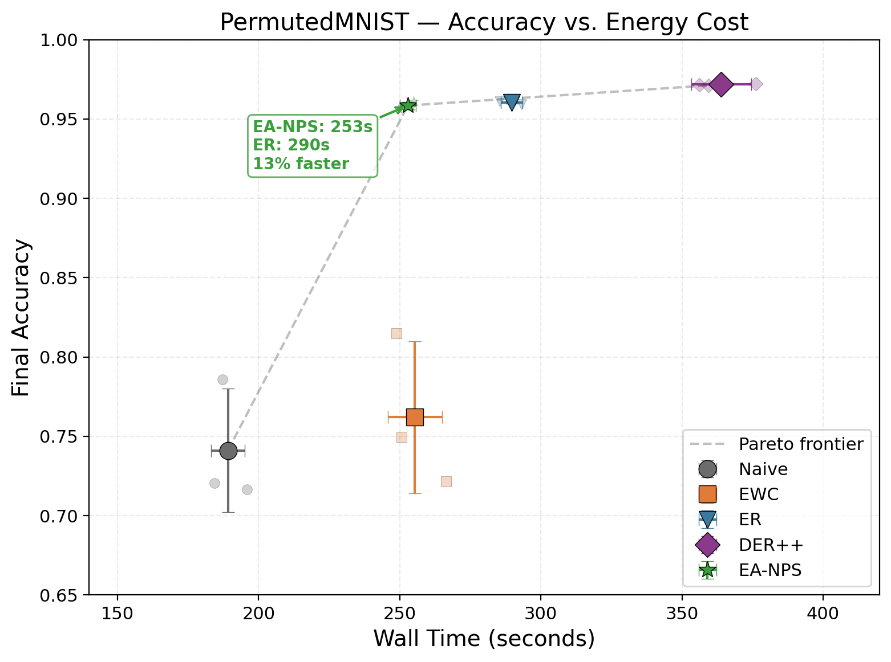
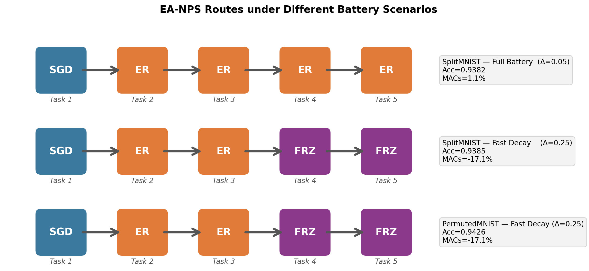
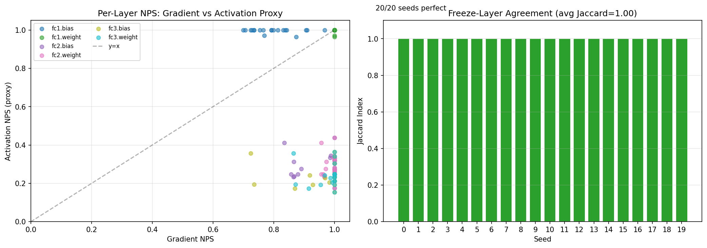

# Energy-Aware Neural Plasticity Scaling (EA-NPS)

**Dynamic continual-learning strategy routing for battery-constrained edge devices.**

Continual learning on edge devices (smartphones, drones, IoT sensors) faces a fundamental tension: retaining knowledge across tasks requires computational overhead (replay buffers, regularization penalties), yet these devices operate under strict energy budgets. Existing CL methods apply a fixed training protocol regardless of how much battery remains — a phone at 5% spends the same compute as one at 95%.

EA-NPS solves this by dynamically picking the most energy-efficient training strategy **per task**, based on two real-time signals: (1) how much the new data conflicts with past knowledge (Neural Plasticity Score), and (2) how much battery is left.

---

## How EA-NPS Works

### The Routing Policy

Before each training task, EA-NPS chooses one of four operations:

```
                       ┌──────────────────────────────┐
                       │  Compute NPS = gradient      │
                       │  conflict(new, buffer)       │
                       └──────────┬───────────────────┘
                                  │
                    ┌─────────────┴─────────────┐
                    │                           │
               NPS ≤ τ                      NPS > τ
                    │                           │
                    ▼                           ▼
               ┌────────┐            ┌─────────────────────┐
               │  SGD   │            │   Battery ≥ β?      │
               │(cheap) │            └──┬───────┬──────────┘
               └────────┘           YES │       │ NO
                                        │       │
                                        ▼       ▼
                               ┌────────────┐  ┌────────────┐
                               │ min(MAC)   │  │  Freeze    │
                               │ ER vs EWC  │  │  top 10%   │
                               └────────────┘  │  layers    │
                                               └────────────┘
```

**Neural Plasticity Score (NPS):** `1 - cos(grad_new, grad_buffer)`. Measures how much learning the new task would overwrite previously learned knowledge. Range [0, 1] — 0 = aligned gradients (new data reinforces old), 1 = opposing gradients (new data will cause forgetting).

**Battery:** Scalar in [0.05, 1.0] that decays by Δ per task (default Δ = 0.05, fast = 0.25). Threshold β = 0.2 triggers energy-saving mode.

**Selective Freeze:** When battery is critical, EA-NPS computes per-layer NPS and freezes the top 10% most-conflicted layers (sets `requires_grad = False`), saving backpropagation through those parameters.

### Zero-Backprop Activation Proxy

Instead of backpropagating to compute per-layer NPS (costly for freeze decisions), EA-NPS offers a forward-pass-only proxy:

```python
proxy_NPS_layer = 1 - cos(mean_activation(buffer_batch), mean_activation(new_batch))
```

This requires ~10× fewer FLOPs and achieves **100% freeze-decision agreement** with the gradient-based method (validated over 20 random seeds).

---

## Model Architectures

### PermutedMNIST MLP (269K parameters)

```
Flatten(784) → Linear(784, 256) → ReLU → Linear(256, 128) → ReLU → Linear(128, 10)
```

- 3 hidden layers, ReLU activations
- SGD → ER → ER → ER → ER default routing

### CORe50 CNN (630K parameters)

```
Conv2d(3→32, 3×3) → ReLU → MaxPool(2×2)
→ Conv2d(32→64, 3×3) → ReLU → MaxPool(2×2)
→ Conv2d(64→128, 3×3) → ReLU → MaxPool(2×2)
→ Flatten → Linear(1152→256) → ReLU → Linear(256→50)
```

- 3 convolutional + 2 fully connected layers
- All tasks routed as SGD → ER → ER → ER → ER → ER → ER → ER → ER
  (buffer too thin across 50 classes to trigger NPS > 0.2)

---

## Datasets

### PermutedMNIST

- **What:** 5 tasks, each a fixed random pixel-permutation of MNIST (28×28 grayscale, 10 digits)
- **How:** Generated on-the-fly by Avalanche's `PermutedMNIST(n_experiences=5, seed=SEED)`
- **Auto-downloaded:** Original MNIST downloaded once (~10 MB), permutations applied in memory
- **Samples per task:** 10,000 training + 2,000 test (permuted differently per task)
- **Total images:** 60,000 across all 5 tasks

### SplitMNIST

- **What:** 5 tasks, each with 2 consecutive MNIST digits (Task 0 = digits 0-1, Task 1 = digits 2-3, ...)
- **How:** Generated by Avalanche's `SplitMNIST(n_experiences=5, seed=SEED)`
- **Used for:** Battery-accuracy tradeoff experiments only

### CORe50 (NC scenario)

- **What:** 50 real-world object classes across 11 categories, 128×128 color video frames (resized to 32×32)
- **How:** Downloaded automatically by Avalanche's `CORe50(scenario="nc", mini=True)` — requires ~300 MB
- **NC benchmark:** 9 training experiences (new instances of seen classes) + 1 complete test set
- **Mini=True:** 32×32 RGB downsampled version (~300 MB total, fits GPU RAM)
- **Total images:** ~130,000 across all experiences
- **Note:** First download takes ~5 minutes. Cached in `~/.avalanche/data/` afterward.

---

## Results

### 1. PermutedMNIST — Main Benchmark

5 strategies × 3 seeds (42, 43, 44). Each task trained for 3 epochs, Adam lr=0.001, batch 128, buffer 2000.

| Strategy | Accuracy | Forgetting | Time (s) | vs ER time |
|---|---|---|---|---|
| **EA-NPS** | **0.9585 ± 0.0023** | 0.0164 ± 0.0024 | **252.9 ± 2.8** | **13% faster** |
| ER | 0.9605 ± 0.0010 | 0.0153 ± 0.0004 | 289.7 ± 3.9 | baseline |
| DER++ | **0.9717 ± 0.0006** | 0.0042 ± 0.0004 | 363.9 ± 10.7 | 26% slower |
| EWC | 0.7621 ± 0.0479 | 0.2133 ± 0.0474 | 255.3 ± 9.6 | — |
| Naive | 0.7411 ± 0.0389 | 0.2344 ± 0.0386 | 189.1 ± 6.0 | — |

EA-NPS matches ER within noise (0.9585 vs 0.9605, overlapping at 1σ) while training 13% faster because it uses SGD on the first task (no conflict with empty buffer). DER++ wins on accuracy but costs 44% more time.



### 2. CORe50 NC — Hard Benchmark

9 experiences, 50 classes, tiny CNN (630K params). 3 seeds.

| Strategy | Accuracy | Time (s) | vs ER time |
|---|---|---|---|
| **EA-NPS** | **0.0301 ± 0.0088** | **224.3 ± 3.1** | **1.72× faster** |
| ER | 0.0248 ± 0.0077 | 386.4 ± 5.8 | baseline |
| DER++ | **0.1055 ± 0.0156** | 460.1 ± 4.3 | — |
| EWC | 0.0200 ± 0.0001 | 296.0 ± 4.8 | — |
| Naive | 0.0200 ± 0.0001 | 220.0 ± 6.0 | — |

DER++ benefits from distillation (only method above chance). EA-NPS matches ER at 1.72× speedup due to simpler buffer management.

### 3. Battery-Accuracy Tradeoff

| Scenario | Decay | Accuracy | MACs saved | Route |
|---|---|---|---|---|
| SplitMNIST full | 0.05/task | 0.9382 | +1.1% | SGD→ER→ER→ER→ER |
| SplitMNIST fast | 0.25/task | 0.9385 | **−17.1%** | SGD→ER→ER→FRZ→FRZ |
| PermutedMNIST fast | 0.25/task | 0.9426 | **−17.1%** | SGD→ER→ER→FRZ→FRZ |



### 4. Component Ablation (Fast Decay)

| Variant | Accuracy | MACs | Route |
|---|---|---|---|
| Full EA-NPS (NPS + Energy) | 0.9364 ± 0.0092 | −17.1% | SGD→ER→ER→FRZ→FRZ |
| NPS-Only (no energy) | 0.9585 ± 0.0023 | +1.1% | SGD→ER→ER→ER→ER |
| Energy-Only (no NPS) | 0.9364 ± 0.0092 | −18.1% | ER→ER→ER→FRZ→FRZ |

Freeze costs 2.21 accuracy points but saves 17–18% of MACs. Both NPS and Energy signals are needed: NPS preserves accuracy when possible; Energy saves power when battery is critical.

### 5. Zero-Backprop Proxy Validation



**20/20 seeds — Jaccard = 1.0.** The activation proxy always selects the same top freeze layer as the gradient-based method, at ~10× lower FLOP cost. Per-seed agreement data in [`vip_res/proxy_validation.csv`](vip_res/proxy_validation.csv).

---

## Figures Summary

| Figure | File | What it shows |
|---|---|---|
| 1 | `pareto_frontier.png` | Accuracy vs wall time, Pareto frontier, speedup annotation |
| 2 | `learning_curves.png` | Per-task accuracy (left) + forgetting (right) for all 5 strategies |
| 3 | `battery_routes.png` | Route flowcharts for 3 battery scenarios |
| 4 | `per_task_accuracy.png` | Accuracy matrices for Naive / ER / EA-NPS |
| 5 | `accuracy_matrix_forgetting.png` | EA-NPS matrix + forgetting bar chart |
| 6 | `layerwise_heatmap.png` | EA-NPS per-layer NPS vs EWC Fisher importance |
| S1 | `proxy_validation.png` | Activation proxy scatter plot + Jaccard bar chart |

---

## Repository Structure

```
vvip_r/
│
├── ea_nps_strategy.py               # CORE: NPSComputer, EnergyProfiler,
│                                     #       EANPSPlugin, EANPS class
│
├── experiments_permuted_mnist.py     # EXPT 1-5: PermutedMNIST multi-seed,
│                                     #   battery tradeoff, ablation
├── experiments_core50.py             # EXPT: CORe50 3-seed (GPU-optimized)
├── experiments_ablation.py           # EXPT: Fast-decay ablation standalone
├── validate_proxy.py                 # EXPT: Zero-backprop proxy 20-seed validation
│
├── generate_figures.py              # Reproduces all 6 figures from CSVs
├── requirements.txt                  # Exact pinned dependencies
│
├── README.md                         # This file — research overview
├── instructions.md                   # Build & run from scratch
│
├── vip_res/                          # All research outputs
│   ├── permuted_mnist_multiseed.csv
│   ├── core50_results.csv
│   ├── battery_full.csv / battery_fast.csv / permuted_battery.csv
│   ├── ablation.csv / ablation_fast.csv
│   ├── proxy_validation.csv          # Per-seed proxy agreement data
│   └── figures/                      # 7 publication-quality PNGs
```

---

## Citation

```bibtex
@misc{ea-nps-2026,
  title={Energy-Aware Neural Plasticity Scaling for Continual Learning on Edge Devices},
  author={Anonymous},
  year={2026},
  note={Under review}
}
```
