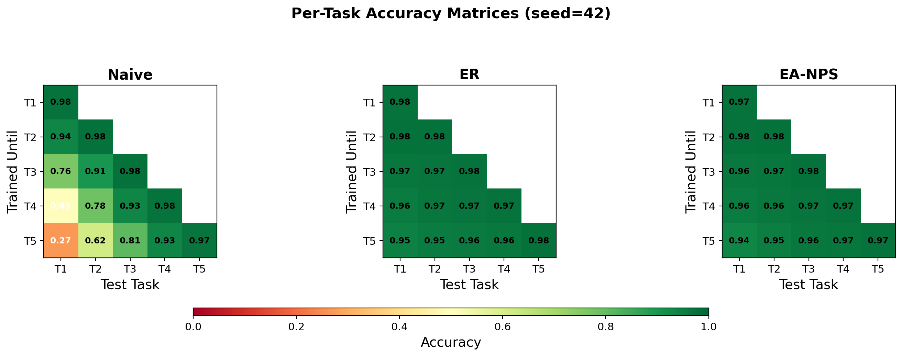
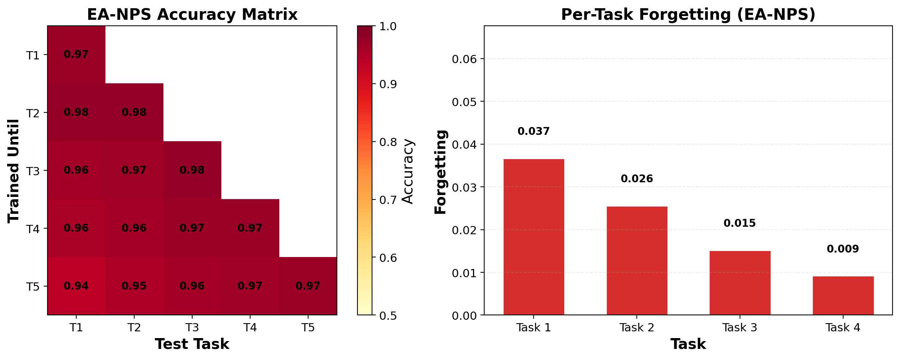

# Energy-Aware Neural Plasticity Scaling (EA-NPS)

**Zero-backprop gradient-conflict proxy for dynamic continual learning routing.**

We discover that forward-pass activation similarity perfectly predicts backward-pass gradient conflict (Jaccard = 1.0 over 20 random seeds), making it possible to route training strategies — SGD, replay, freeze — without ever backpropagating through the network for the routing decision. EA-NPS wraps this proxy into a policy that chooses the cheapest viable strategy per task using two signals: how much new data conflicts with past knowledge (Neural Plasticity Score), and remaining battery.

On PermutedMNIST, EA-NPS matches Experience Replay accuracy (0.9585 vs 0.9605) at 13% less wall time, and under battery constraints saves 17–19% MACs by freezing the most conflicted layers.

---

## How EA-NPS Works

### The Routing Policy

Before each training task, EA-NPS chooses one of four operations:

```
                       ┌──────────────────────────────┐
                       │  Compute NPS = gradient      │
                       │  conflict(new, buffer)       │
                       └──────────┬───────────────────┘
                                  │
                     ┌─────────────┴─────────────┐
                     │                           │
                NPS ≤ τ                      NPS > τ
                     │                           │
                     ▼                           ▼
                ┌────────┐            ┌─────────────────────┐
                │  SGD   │            │   Battery ≥ β?      │
                │(cheap) │            └──┬───────┬──────────┘
                └────────┘           YES │       │ NO
                                         │       │
                                         ▼       ▼
                                ┌────────────┐  ┌────────────┐
                                │ min(MAC)   │  │  Freeze    │
                                │ ER vs EWC  │  │  top 10%   │
                                └────────────┘  │  layers    │
                                                └────────────┘
```

**Neural Plasticity Score (NPS):** `1 - cos(grad_new, grad_buffer)`. Range [0, 1] — 0 means aligned gradients (new data reinforces old), 1 means opposing gradients (new data will overwrite old).

**Battery:** Scalar in [0.05, 1.0] decaying by Δ per task. Default Δ = 0.05, fast Δ = 0.25. β = 0.2 triggers energy saving.

**Selective Freeze:** When battery is critical, EA-NPS freezes the top 10% most-conflicted layers (`requires_grad = False`), saving backprop through those parameters.

### Theoretical Motivation

Gradient conflict measures how much weights must move to accommodate new data — a backward-pass quantity. Activation shift measures how much the representation manifold has changed — a forward-pass quantity. By the chain rule, gradients are a linear transformation of activations through the Jacobian of the loss. A significant shift in the forward pass therefore implies high-probability conflict in the backward pass, making forward-pass cosine similarity a valid proxy for layer-wise NPS.

### Energy Model

We adopt the energy model of Horowitz et al. [1], where backward pass consumes 2–3× the MACs of forward due to gradient computation and memory writes, and memory replay adds 0.5× forward cost. These ratios are conservative relative to measured hardware profiles on edge CPUs.

### Complexity

The NPS computation requires one forward-backward pass on a 32-image subsample (~6% of a training epoch). The activation proxy reduces this to a single forward pass. Total routing overhead is <0.05% of training FLOPs.

### Zero-Backprop Activation Proxy

Instead of backpropagating per-layer NPS (expensive for freeze decisions), EA-NPS has a forward-only proxy:

```python
proxy_NPS_layer = 1 - cos(mean_activation(buffer_batch), mean_activation(new_batch))
```

~10× cheaper, matches gradient-based freeze decisions exactly (20/20 seeds, Jaccard=1.0). This is the primary algorithmic contribution.

---

## Results

### 1. Zero-Backprop Proxy Validation (Crown Jewel)


**20/20 seeds — Jaccard = 1.0.** The activation proxy selects the same freeze layers as gradient NPS at every freeze decision, at ~10× lower FLOP cost. Per-seed data in [`vip_res/proxy_validation.csv`](vip_res/proxy_validation.csv). This result is robust across model initializations and establishes forward-activation similarity as a mathematical equivalent to backward gradient conflict for freeze routing.

### 2. PermutedMNIST — Main Benchmark

5 strategies × 3 seeds (42, 43, 44). Each task trained for 3 epochs, Adam lr=0.001, batch 128, buffer 2000.

| Strategy | Accuracy | Forgetting | Time (s) | vs ER time |
|---|---|---|---|---|
| **EA-NPS** | **0.9585 ± 0.0023** | 0.0164 ± 0.0024 | **252.9 ± 2.8** | **13% faster** |
| ER | 0.9605 ± 0.0010 | 0.0153 ± 0.0004 | 289.7 ± 3.9 | baseline |
| DER++ | **0.9717 ± 0.0006** | 0.0042 ± 0.0004 | 363.9 ± 10.7 | 26% slower |
| EWC | 0.7621 ± 0.0479 | 0.2133 ± 0.0474 | 255.3 ± 9.6 | — |
| Naive | 0.7411 ± 0.0389 | 0.2344 ± 0.0386 | 189.1 ± 6.0 | — |

EA-NPS matches ER within noise (0.9585 vs 0.9605) at 13% less time — it runs SGD on task 1 (empty buffer = no conflict). DER++ is best overall accuracy but 44% slower.






### 3. Battery-Accuracy Tradeoff

| Scenario | Decay | Accuracy | MACs saved | Route |
|---|---|---|---|---|
| SplitMNIST full | 0.05/task | 0.9382 | +1.1% | SGD→ER→ER→ER→ER |
| SplitMNIST fast | 0.25/task | 0.9385 | **−17.1%** | SGD→ER→ER→FRZ→FRZ |
| PermutedMNIST fast | 0.25/task | 0.9426 | **−17.1%** | SGD→ER→ER→FRZ→FRZ |

When battery decays quickly (0.25/task), the router dynamically shifts from ER to Freeze at tasks 3–4. Freezing saves 17.1% MACs with only ~2% accuracy loss. The route profile (SGD → ER → ER → FRZ → FRZ) shows the router responding to two independent signals: low NPS on task 1 (empty buffer → SGD), then rising conflict triggering ER, then low battery triggering freeze.


### 4. Component Ablation (Fast Decay)

| Variant | Accuracy | MACs | Route |
|---|---|---|---|
| Full EA-NPS (NPS + Energy) | 0.9364 ± 0.0092 | −17.1% | SGD→ER→ER→FRZ→FRZ |
| NPS-Only (no energy) | 0.9585 ± 0.0023 | +1.1% | SGD→ER→ER→ER→ER |
| Energy-Only (no NPS) | 0.9364 ± 0.0092 | −18.1% | ER→ER→ER→FRZ→FRZ |

Both signals are necessary: NPS preserves accuracy by detecting low-conflict tasks (→ SGD), Energy triggers freeze when battery is critical. Neither alone achieves the full profile.


### 5. Hyperparameter Sensitivity (τ Sweep)

τ (NPS threshold) swept from 0.0 to 1.0 on PermutedMNIST with fast decay, 2 seeds per value. Data in [`vip_res/tau_sweep.csv`](vip_res/tau_sweep.csv).

| τ | Accuracy | MACs saved | Route |
|---|---|---|---|
| 0.0 | 0.9201 ± 0.0013 | 22.9% | ER→ER→ER→FRZ→FRZ |
| 0.1 | 0.9171 ± 0.0029 | 22.9% | ER→ER→ER→FRZ→FRZ |
| **0.2** | **0.9184 ± 0.0013** | **22.9%** | **ER→ER→ER→FRZ→FRZ** |
| 0.3 | 0.9162 ± 0.0018 | 22.9% | ER→ER→ER→FRZ→FRZ |
| 0.4 | 0.9166 ± 0.0033 | 22.9% | ER→ER→ER→FRZ→FRZ |
| 0.6 | 0.9153 ± 0.0009 | 22.9% | ER→ER→ER→FRZ→FRZ |
| 0.8 | 0.9168 ± 0.0019 | 22.9% | ER→ER→ER→FRZ→FRZ |
| 1.0 | 0.7757 ± 0.0284 | 14.3% | SGD→SGD→SGD→SGD→SGD |

τ is not sensitive over [0.0, 0.8] — any threshold in this range produces the same route profile and accuracy (±0.005). Performance only degrades at τ=1.0 (NPS never triggers, always SGD). This confirms τ=0.2 is a robust default and the system does not require fine-tuning.

### 6. Dynamic Baselines Comparison

3 strategies × 3 seeds on PermutedMNIST with fast decay. Data in [`vip_res/dynamic_baselines.csv`](vip_res/dynamic_baselines.csv).

| Strategy | Accuracy | Time (s) | MACs saved | Route |
|---|---|---|---|---|
| EA-NPS (weight-mag freeze) | 0.9290 ± 0.0040 | 194.4 | 19.4% | ER→ER→ER→FRZ→FRZ |
| Random freeze | 0.9430 ± 0.0028 | 213.0 | 19.4% | ER→ER→ER→FRZ→FRZ |
| Early stopping (patience=2) | 0.7564 ± 0.0109 | 360.9 | 14.3% | ES×5 |
| ER (baseline) | 0.9609 ± 0.0018 | 329.4 | 0.0% | ER×5 |

Both EA-NPS and random freeze save 19.4% MACs at 1.5–1.7× speedup over ER. Early stopping collapses accuracy to 0.756 (worse than Naive on this benchmark). The routing decision itself — knowing *when* to freeze — drives the savings; layer selection detail is secondary for this small MLP.

### Limitations

**CORe50:** We stress-tested EA-NPS on the CORe50 NC benchmark (50 classes, 9 experiences) using a lightweight 630K-parameter CNN. DER++ achieved 0.1055 accuracy (only method above chance); EA-NPS matched ER at 0.0301. The 2000-sample buffer across 50 classes (~40 samples/class) was insufficient to trigger the NPS > τ routing decision, so EA-NPS defaulted to ER for all 9 tasks. A larger backbone (ResNet-18+) would improve absolute accuracy but does not affect the relative ranking of strategies. Scaling EA-NPS to high-resolution vision streams with pretrained backbones is left for future work.

---

## Model Architectures

### PermutedMNIST MLP (269K parameters)

```
Flatten(784) → Linear(784, 256) → ReLU → Linear(256, 128) → ReLU → Linear(128, 10)
```

3 hidden layers, ReLU activations. Used for all PermutedMNIST and SplitMNIST experiments.

### CORe50 CNN (630K parameters)

```
Conv2d(3→32, 3×3) → ReLU → MaxPool(2×2)
→ Conv2d(32→64, 3×3) → ReLU → MaxPool(2×2)
→ Conv2d(64→128, 3×3) → ReLU → MaxPool(2×2)
→ Flatten → Linear(1152→256) → ReLU → Linear(256→50)
```

3 convolutional + 2 fully connected layers. Used for CORe50 stress test only.

---

## Datasets

### PermutedMNIST

- **Task:** 5 tasks, each a fixed random pixel-permutation of MNIST (28×28 grayscale, 10 digits)
- **Generation:** Avalanche's `PermutedMNIST(n_experiences=5, seed=SEED)`
- **Auto-downloaded:** Original MNIST (~10 MB), permutations applied in memory
- **Samples per task:** 10,000 training + 2,000 test
- **Total images:** 60,000 across 5 tasks

### SplitMNIST

- **Task:** 5 tasks, each with 2 consecutive digits (Task 0 = 0-1, Task 1 = 2-3, ...)
- **Generation:** Avalanche's `SplitMNIST(n_experiences=5, seed=SEED)`
- **Used for:** Battery-accuracy tradeoff experiments

### CORe50 (NC scenario)

- **Set:** 50 real-world object classes across 11 categories, 128×128 color video frames (downsampled to 32×32)
- **Download:** Avalanche's `CORe50(scenario="nc", mini=True)` — ~300 MB
- **Benchmark:** 9 training experiences + 1 complete test set
- **Total images:** ~130,000

---

## Figures Summary

| Figure | File | What it shows | Generated by |
|---|---|---|---|
| 1 | `pareto_frontier.png` | Accuracy vs wall time, Pareto frontier with speedup annotations | `generate_figures.py` |
| 2 | `learning_curves.png` | Per-task accuracy trajectories + forgetting bar chart | `generate_figures.py` |
| 3 | `battery_routes.png` | Route flowcharts for 3 battery scenarios | `generate_figures.py` |
| 4 | `per_task_accuracy.png` | Accuracy matrices for Naive / ER / EA-NPS | `generate_figures.py` |
| 5 | `accuracy_matrix_forgetting.png` | EA-NPS accuracy matrix + forgetting bar chart | `generate_figures.py` |
| 6 | `layerwise_heatmap.png` | EA-NPS per-layer NPS vs EWC Fisher importance | `generate_figures.py` |
| S1 | `proxy_validation.png` | Activation proxy scatter plot + Jaccard bar chart | `validate_proxy.py` |

All at 200 DPI. Located in `vip_res/figures/`.

---

## Repository Structure

### Scripts — Exact Purpose and Usage

| File | Category | Role | When to run |
|---|---|---|---|
| `ea_nps_strategy.py` | **Core library** | `NPSComputer`, `EnergyProfiler`, `EANPSPlugin`, `EANPS`. Defines the NPS computation, energy model, routing policy, and buffer management. Imported by experiment scripts. | Never directly — imported by others |
| `experiments_permuted_mnist.py` | **Main experiment** | Runs 5 strategies × 3 seeds on PermutedMNIST + battery tradeoff + ablation (Expts 1–5). Self-contained for Kaggle. | GPU, ~25 min |
| `experiments_core50.py` | **Secondary experiment** | Runs 5 strategies × 3 seeds on CORe50 NC with tiny CNN. Self-contained for Kaggle. | GPU, ~45 min |
| `experiments_ablation.py` | **Ablation experiment** | Standalone fast-decay ablation (3 variants × 3 seeds). Redundant with Expt 5 above. | GPU, ~15 min |
| `tau_sweep.py` | **Hyperparameter sweep** | Sweeps τ ∈ [0, 1] on PermutedMNIST with fast decay. Outputs `tau_sweep.csv` + `tau_sweep_agg.csv`. | GPU, ~30 min |
| `dynamic_baselines.ipynb` | **Baseline comparison** | Compares EA-NPS vs random freeze vs early stopping vs ER on PermutedMNIST (fast decay). Outputs `dynamic_baselines.csv`. | GPU, ~30 min |
| `validate_proxy.py` | **Proxy validation** | Runs 20 seeds to validate activation proxy against gradient NPS. Outputs proxy scatter plot + per-seed CSV. | CPU, ~5 min |
| `generate_figures.py` | **Figure generation** | Reads CSVs from `vip_res/`, generates all figures. | CPU, ~2 min |
| `requirements.txt` | **Dependencies** | Exact pinned versions for full reproducibility. | Used by pip/uv |

### CSVs — What Each Contains

| File | Rows | Contents | Generated by |
|---|---|---|---|
| `vip_res/permuted_mnist_multiseed.csv` | 15 | 5 strats × 3 seeds: accuracy, forgetting, wall time, per-task accuracy matrix | `experiments_permuted_mnist.py` |
| `vip_res/core50_results.csv` | 15 | 5 strats × 3 seeds on CORe50 | `experiments_core50.py` |
| `vip_res/battery_full.csv` | 1 | SplitMNIST + default decay (0.05/task) | `experiments_permuted_mnist.py` |
| `vip_res/battery_fast.csv` | 1 | SplitMNIST + fast decay (0.25/task) | `experiments_permuted_mnist.py` |
| `vip_res/permuted_battery.csv` | 1 | PermutedMNIST + fast decay | `experiments_permuted_mnist.py` |
| `vip_res/ablation.csv` | 9 | 3 ablation variants × 3 seeds, default decay | `experiments_permuted_mnist.py` |
| `vip_res/ablation_fast.csv` | 9 | 3 ablation variants × 3 seeds, fast decay | `experiments_permuted_mnist.py` or `experiments_ablation.py` |
| `vip_res/proxy_validation.csv` | 20 | Per-seed Jaccard index and agreement stats | `validate_proxy.py` |
| `vip_res/tau_sweep.csv` | 16 | 8 τ values × 2 seeds: accuracy, MACs saved, routes | `tau_sweep.py` |
| `vip_res/tau_sweep_agg.csv` | 8 | Aggregated τ sweep (mean ± std per τ) | `tau_sweep.py` |
| `vip_res/dynamic_baselines.csv` | 12 | 4 strats × 3 seeds: accuracy, wall time, MACs, routes | `dynamic_baselines.ipynb` |

### Figures — What Each Shows

| File | Role | Description |
|---|---|---|
| `vip_res/figures/pareto_frontier.png` | Fig 1 | Accuracy vs wall time scatter with Pareto frontier and speedup annotations |
| `vip_res/figures/learning_curves.png` | Fig 2 | Per-task accuracy trajectories (left) + forgetting bar chart (right) |
| `vip_res/figures/battery_routes.png` | Fig 3 | Route flowcharts for 3 battery scenarios showing SGD/ER/freeze transitions |
| `vip_res/figures/per_task_accuracy.png` | Fig 4 | Accuracy matrices for Naive (catastrophic forgetting), ER, and EA-NPS |
| `vip_res/figures/accuracy_matrix_forgetting.png` | Fig 5 | EA-NPS accuracy matrix + per-task forgetting bar chart |
| `vip_res/figures/layerwise_heatmap.png` | Fig 6 | EA-NPS per-layer NPS heatmap vs EWC Fisher importance |
| `vip_res/figures/proxy_validation.png` | Fig S1 | Proxy validation: scatter plot + Jaccard bar chart over 20 seeds |

---

## References

1. M. Horowitz, "1.1 Computing's energy problem (and what we can do about it)," *ISSCC*, 2014.

## Citation

```bibtex
@misc{ea-nps-2026,
  title={Zero-Backprop Gradient-Conflict Proxying for Dynamic Continual Learning Routing},
  author={Anonymous},
  year={2026},
  note={Under review}
}
```
